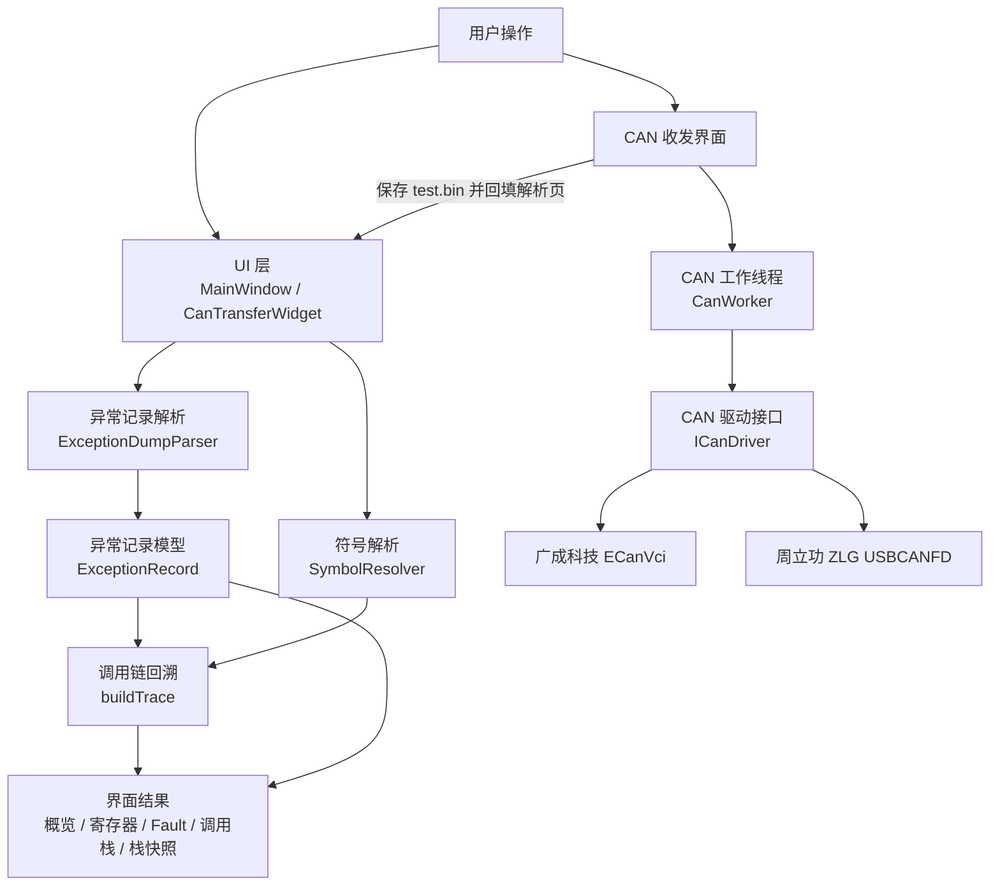
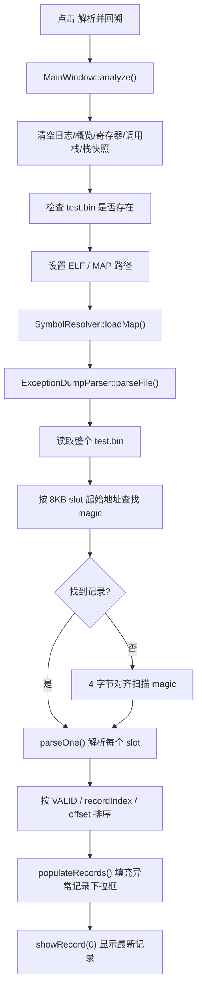
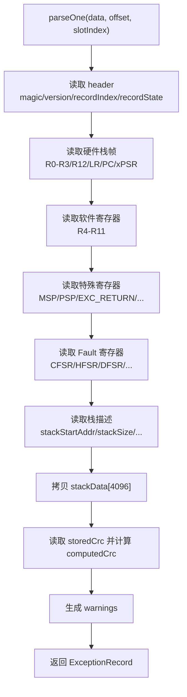
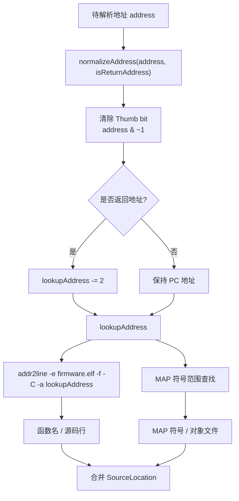
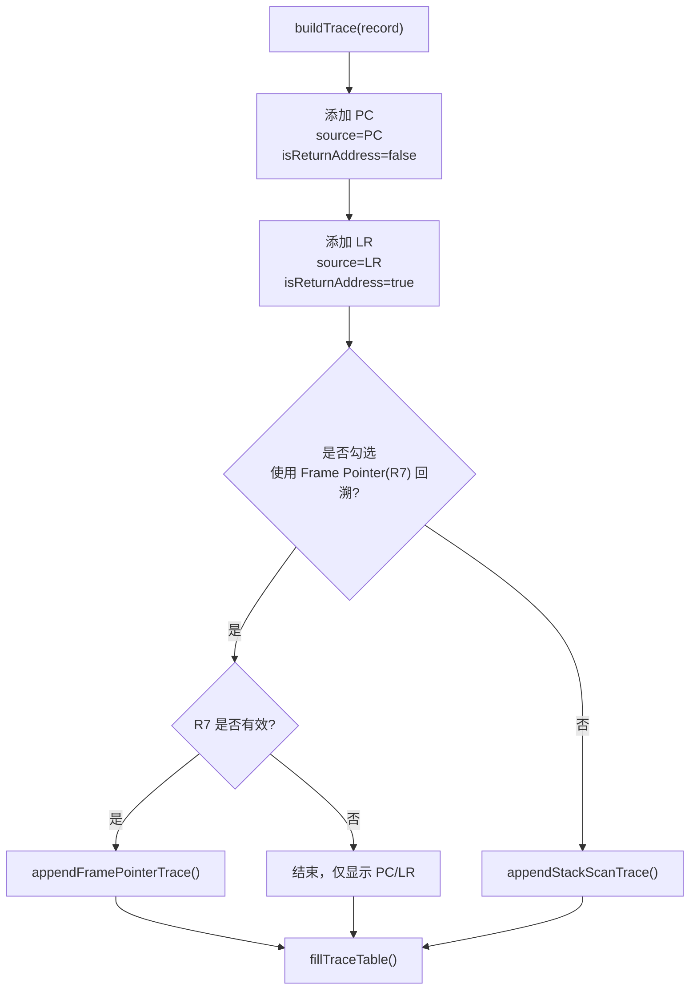
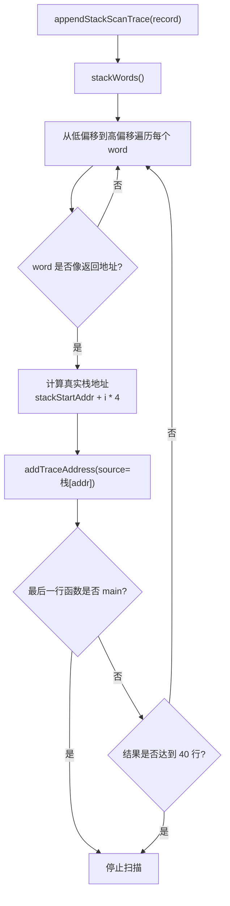
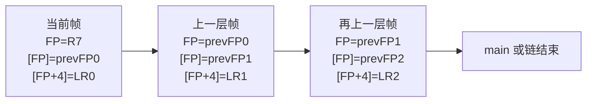
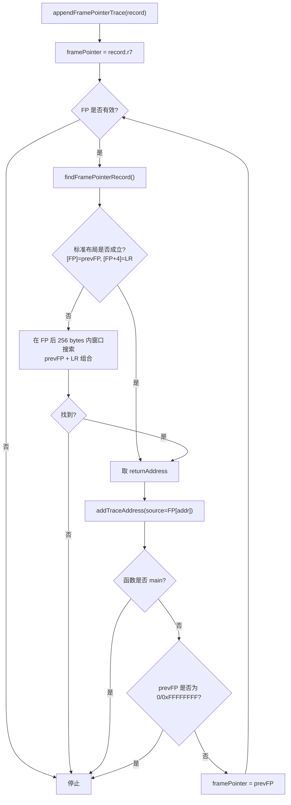
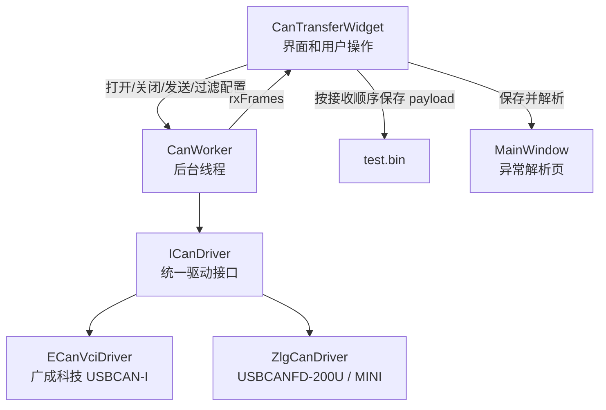

# ExceptionDumpAnalyzer 架构设计说明

`ExceptionDumpAnalyzer` 是一个基于 Qt 5 Widgets 的 PC 端异常现场解析与回溯工具。它的核心目标是把设备端导出的异常现场二进制数据 `test.bin`，结合固件对应的 `ELF` 和 `MAP` 文件，解析成可读的寄存器、Fault 状态、栈快照和调用链回溯结果。

工具现在同时集成了 CAN 收发界面，可以通过 USB CAN 设备直接接收设备端发送的异常现场数据帧，保存成 `test.bin` 后复用同一套异常解析和回溯流程。

## 1. 功能范围

### 1.1 输入文件

| 输入 | 用途 |
| --- | --- |
| `test.bin` | 设备端保存或通过 CAN 接收得到的异常现场二进制文件。 |
| `*.elf` | 固件 ELF 文件，用于 `arm-none-eabi-addr2line` 精确解析函数名和源码行。 |
| `*.map` | 固件 MAP 文件，用于建立 `.text` 符号范围，辅助地址过滤和符号兜底。 |

### 1.2 输出信息

| 输出区域 | 内容 |
| --- | --- |
| 异常概览 | 记录格式、slot、文件偏移、magic、version、recordIndex、recordState、CRC、异常类型、PC、LR、栈范围等。 |
| 寄存器 | 硬件自动压栈寄存器、软件保存寄存器、特殊寄存器、Fault 寄存器、栈描述信息。 |
| Fault 解码 | CFSR/HFSR/DFSR 等寄存器按 bit 解码后的异常原因说明。 |
| 调用栈 | PC、LR、栈扫描或 Frame Pointer 回溯得到的调用链。 |
| 栈快照 | `stackData` 中的原始 word、对应真实 MCU 地址，以及可解析出的疑似符号。 |
| CAN 收发 | CAN/CAN FD 设备打开、请求帧发送、报文接收、过滤、分组/顺序显示、二进制保存。 |

## 2. 工程目录结构

本工程按单一 `.pro` 管理，不维护源码目录内的 Makefile。Qt Creator 或打包脚本产生的编译输出统一放在 `packages` 下。

```text
ExceptionDumpAnalyzer
├── ExceptionDumpAnalyzer.pro
├── README.md
├── include
│   ├── can
│   │   ├── can_driver.h
│   │   ├── can_transfer_widget.h
│   │   ├── can_worker.h
│   │   ├── ecan_vci_driver.h
│   │   └── zlg_can_driver.h
│   ├── core
│   │   ├── exception_record.h
│   │   └── symbol_resolver.h
│   └── ui
│       └── main_window.h
├── src
│   ├── main.cpp
│   ├── can
│   │   ├── can_driver.cpp
│   │   ├── can_transfer_widget.cpp
│   │   ├── can_worker.cpp
│   │   ├── ecan_vci_driver.cpp
│   │   └── zlg_can_driver.cpp
│   ├── core
│   │   ├── exception_record.cpp
│   │   └── symbol_resolver.cpp
│   └── ui
│       └── main_window.cpp
├── lib
│   ├── ECanVci
│   └── zlg
├── resources
│   ├── resources.qrc
│   └── icons
├── scripts
│   └── deploy_mingw.bat
└── packages
    ├── build-ExceptionDumpAnalyzer-*
    └── ExceptionDumpAnalyzer_yyyyMMdd_HHmmss
```

## 3. 总体架构

整体分为四层：

1. UI 层：负责用户输入、结果显示、CAN 收发页面和解析页面联动。
2. Core 层：负责异常记录解析、Fault 解码、符号解析和调用链回溯。
3. CAN 层：通过统一驱动接口适配不同厂商 USB CAN 设备。
4. Deploy 层：负责 Qt 运行库、CAN 驱动库和 `addr2line` 工具打包。



核心源码职责：

| 模块 | 文件 | 职责 |
| --- | --- | --- |
| 主窗口 | `src/ui/main_window.cpp` | 解析入口、结果显示、调用链回溯调度。 |
| 异常记录 | `include/core/exception_record.h` | 定义 PC 端解析后的异常记录结构。 |
| 二进制解析 | `src/core/exception_record.cpp` | 读取 `test.bin`、识别 slot、解析寄存器/栈/CRC/Fault。 |
| 符号解析 | `src/core/symbol_resolver.cpp` | 加载 MAP、调用 addr2line、地址归一化、代码地址过滤。 |
| CAN UI | `src/can/can_transfer_widget.cpp` | CAN 设备配置、发送、接收、过滤、保存二进制。 |
| CAN 线程 | `src/can/can_worker.cpp` | 后台收发轮询，避免阻塞 UI。 |
| CAN 抽象 | `include/can/can_driver.h` | 厂商驱动统一接口。 |
| 广成驱动 | `src/can/ecan_vci_driver.cpp` | 适配 ECanVci。 |
| 周立功驱动 | `src/can/zlg_can_driver.cpp` | 适配 USBCANFD-200U / USBCANFD-MINI。 |

## 4. 异常记录二进制格式

当前 PC 端按固定 8KB 异常记录帧解析，每个 slot 大小固定为 `8192 bytes`。一个 `test.bin` 可以包含多个 slot。

### 4.1 slot 内存布局

```text
单个异常 slot：8192 bytes = 0x2000

偏移       大小        内容
------------------------------------------------------------
0x0000     32 bytes    RecordHeader
0x0020     32 bytes    RecordHwStackFrame
0x0040     32 bytes    RecordSwRegs
0x0060     32 bytes    RecordSpecialRegs
0x0080     32 bytes    RecordFaultRegs
0x00A0     32 bytes    RecordStackInfo
0x00C0   4096 bytes    stackData
0x10C0   3900 bytes    reserved
0x1FFC      4 bytes    crc32
------------------------------------------------------------
```

### 4.2 结构体字段说明

| 区域 | 字段 | 说明 |
| --- | --- | --- |
| `RecordHeader` | `magic` | 固定魔术字 `0x45584350`，ASCII 为 `EXCP`。 |
| `RecordHeader` | `version[4]` | 固件版本或项目自定义版本信息。 |
| `RecordHeader` | `recordIndex` | 全局递增记录号，用于判断最新异常记录。 |
| `RecordHeader` | `recordState` | 记录状态，`VALID` 优先显示。 |
| `RecordHwStackFrame` | `r0 r1 r2 r3 r12 lr pc xpsr` | Cortex-M 异常进入时硬件自动压栈的基础栈帧。 |
| `RecordSwRegs` | `r4 ~ r11` | 设备端异常入口中软件手动保存的寄存器。 |
| `RecordSpecialRegs` | `msp psp excReturn control primask basepri faultmask faultType` | 特殊寄存器和异常类型。 |
| `RecordFaultRegs` | `cfsr hfsr dfsr afsr mmfar bfar shcsr ccr` | Fault 状态寄存器。 |
| `RecordStackInfo` | `stackStartAddr` | `stackData[0]` 对应的真实 MCU 栈地址。 |
| `RecordStackInfo` | `stackSize` | `stackData` 中有效字节数，最大 4096。 |
| `RecordStackInfo` | `stackLimit stackTop` | 栈空间边界，用于辅助判断栈是否合理。 |
| `stackData` | 原始栈快照 | 调用链回溯的主要数据来源之一。 |
| `crc32` | 校验值 | 校验前 `8192 - 4` 字节。 |

## 5. 解析流程

解析入口是 `MainWindow::analyze()`。它负责准备 UI、加载符号文件，然后调用 `ExceptionDumpParser::parseFile()` 解析二进制文件。



### 5.1 文件读取

`parseFile()` 会一次性把 `test.bin` 读入 `QByteArray`。这样后续解析只在内存中按偏移读取，不会反复访问文件。

### 5.2 slot 查找策略

第一轮按固定 slot 查找：

```text
offset = slotIndex * 8192
if readU32(offset) == 0x45584350:
    parseOne(offset, slotIndex)
```

如果第一轮没有找到任何记录，说明文件可能不是从 slot 边界开始保存的，或者前面有额外数据。此时进入第二轮扫描：

```text
for offset in range(0, fileSize, 4):
    if readU32(offset) == 0x45584350:
        parseOne(offset, records.size())
```

这样可以兼容从 flash 中截取出来但没有严格从 slot 起点开始的二进制文件。

### 5.3 单条记录解析

`parseOne()` 按固定偏移读取字段。所有 32 位字段都按小端序读取。



### 5.4 记录排序

多条记录解析出来后，会按以下优先级排序：

1. `recordState == VALID` 的记录优先。
2. `recordIndex` 大的优先，也就是越新的异常记录越靠前。
3. 如果前两项相同，文件偏移小的优先。

因此界面默认选中的第 0 条通常就是最新的有效异常记录。

### 5.5 栈快照转换

`ExceptionRecord::stackWords()` 会把 `stackData` 转成 32 位 word 数组：

```text
有效字节数 = min(stackData.size(), stackSize, 4096)
每 4 字节按小端序合成一个 uint32_t
```

回溯和栈快照表格都基于这个 word 数组工作。

真实 MCU 栈地址计算方式：

```text
stackWord[i] 的真实地址 = stackStartAddr + i * 4
```

## 6. 符号解析流程

调用链能显示函数名和源码行，依赖 `SymbolResolver`。

符号解析使用两条路径：

1. `addr2line + ELF`：优先提供函数名和源码行。
2. `MAP`：提供 `.text` 符号范围，作为地址过滤和符号兜底。



### 6.1 地址归一化

Cortex-M 使用 Thumb 指令集，函数地址或返回地址最低 bit 常用于表示 Thumb 状态。因此解析源码行前需要清掉 bit0：

```text
normalized = address & ~1
```

如果该地址是返回地址，例如 LR 或栈中扫描出的疑似返回地址，还会再减 2：

```text
lookupAddress = (address & ~1) - 2
```

这样做的原因是：返回地址通常指向调用指令之后的位置，减 2 后更容易落在真正的 `BL` 调用点附近，源码行显示更接近调用发生的位置。

PC 不按返回地址处理，只清 Thumb bit，不减 2。

### 6.2 MAP 解析

`loadMap()` 读取 MAP 文件中的 `Linker script and memory map` 之后的内容，主要提取 `.text` 相关符号。

典型符号范围：

```text
函数名: start <= lookupAddress < end
```

如果符号没有显式大小，代码会用下一个符号的起始地址补齐当前符号的 `end`。这样后续就可以用 `findSymbol()` 判断某个地址是否落在已知代码段中。

### 6.3 addr2line 解析

如果找到 `arm-none-eabi-addr2line.exe` 且 ELF 文件存在，会执行：

```text
arm-none-eabi-addr2line.exe -e firmware.elf -f -C -a lookupAddress
```

输出中的函数名和 `file:line` 会填入 `SourceLocation`。如果 `addr2line` 无法解析，MAP 符号仍然可以作为兜底。

### 6.4 代码地址过滤

调用链回溯时，并不是栈里所有数值都能作为返回地址。代码通过 `isKnownCodeAddress()` 过滤：

1. 如果 MAP 中能找到对应符号，认为是代码地址。
2. 如果没有加载 MAP，则使用保守范围兜底：`0x00000100 <= address < 0x01000000`。
3. 如果 MAP 已加载但找不到符号，则认为不是有效代码地址。

这个过滤对默认栈扫描回溯很关键，可以显著减少误判。

## 7. 调用链回溯设计

调用链回溯入口是 `MainWindow::buildTrace()`。它不直接修改异常记录，而是把异常记录、ELF、MAP 解析结果组合成一组 `TraceRow`，最后显示到“调用栈”表格。

### 7.1 回溯数据来源

当前回溯主要使用以下数据：

| 数据 | 来源 | 作用 |
| --- | --- | --- |
| `PC` | 硬件自动压栈帧 | 异常发生点。 |
| `LR` | 硬件自动压栈帧 | 异常点上一层调用者的返回地址。 |
| `R7` | 软件保存寄存器 | 勾选 Frame Pointer 回溯时作为 FP 链起点。 |
| `stackData` | 栈快照 | 默认栈扫描回溯和 FP 链读取都依赖它。 |
| `stackStartAddr` | 栈描述 | 把 `stackData` 偏移换算成真实 MCU 地址。 |
| `MAP/ELF` | 用户输入文件 | 判断地址是否为代码地址，并解析函数名和源码行。 |

### 7.2 总体回溯流程



不管使用哪种策略，PC 和 LR 都会先尝试显示。

### 7.3 TraceRow 添加规则

所有回溯地址最终都通过 `addTraceAddress()` 添加到结果表。

添加前会做这些判断：

1. 地址不能是 `0`。
2. 地址不能是 `0xFFFFFFFF`。
3. 先通过 `SymbolResolver::resolve()` 解析。
4. 除 PC 外，如果地址解析无效，则不加入调用栈。
5. 按 `lookupAddress` 去重，避免同一个调用点重复显示。

这里特别允许 PC 即使无法解析也显示出来，是为了保证异常点原始地址不会丢失。

### 7.4 默认策略：栈扫描回溯

默认不勾选 R7 时，使用栈扫描策略。这个策略不要求固件编译时保留 frame pointer，适用范围更广。



一个栈 word 必须同时满足下面条件，才会被认为是疑似返回地址：

```text
value != 0
value != 0xFFFFFFFF
value & 1 == 1
isKnownCodeAddress(value, true) == true
```

其中 `value & 1 == 1` 是因为 Cortex-M Thumb 返回地址通常带 Thumb bit。

示意图：

```text
stackData 对应 MCU 栈快照

真实地址          栈中 word              判断
------------------------------------------------------------
stackStart+0x00   0x20006FA8             普通数据，不是代码地址
stackStart+0x04   0x00001B79             bit0=1，MAP 命中，疑似返回地址
stackStart+0x08   0x00000000             忽略
stackStart+0x0C   0x00002645             bit0=1，MAP 命中，疑似返回地址
...
```

表格中会显示：

```text
来源       地址                         函数        源码
栈[addr]   0x00001B79 -> 0x00001B76     foo()       main.c:123
```

注意 `0x00001B79 -> 0x00001B76`：左边是栈里的原始返回地址，右边是清 Thumb bit 并减 2 后实际用于符号解析的地址。

#### 栈扫描策略特点

优点：

- 不依赖编译器保留 R7/R11 frame pointer。
- 只要栈快照里残留了返回地址，就可能回溯出调用路径。
- 对优化编译也有一定容错。

限制：

- 它是启发式扫描，不是严格的链表回溯。
- 栈里可能存在历史返回地址、函数指针、局部变量中的代码地址。
- 显示顺序通常有参考价值，但不能保证每一行都是严格的父调用关系。

### 7.5 Frame Pointer(R7) 回溯策略

勾选“使用 Frame Pointer(R7) 回溯”后，程序只使用 R7 frame pointer 链，不再做默认栈扫描。

该策略假设设备端编译时保留了 R7 作为 frame pointer，并且栈中存在类似链表的帧结构。

标准布局：

```text
当前 FP 指向的栈帧

地址        内容
-------------------------------
FP + 0      previousFramePointer
FP + 4      returnAddress / LR
```

链式结构示意：



Frame Pointer 回溯流程：



### 7.6 Frame Pointer 有效性判断

为了避免死循环或误读栈外数据，代码对 FP 链有严格检查：

| 检查项 | 规则 |
| --- | --- |
| 对齐 | `framePointer` 必须 4 字节对齐。 |
| 范围 | `framePointer` 必须落在当前 `stackData` 快照范围内。 |
| 宽度 | 至少能读取 `[FP]` 和 `[FP+4]` 两个 word。 |
| 链方向 | `nextFramePointer` 必须大于当前 FP。 |
| 链终止 | `nextFramePointer == 0` 或 `0xFFFFFFFF` 认为是合法结束。 |
| 返回地址 | `[FP+4]` 必须是疑似 Thumb 返回地址，并且能命中代码符号。 |
| 最大深度 | 最多回溯 32 层。 |
| 循环保护 | 已访问过的 FP 不会重复访问。 |

这里要求 `nextFramePointer > currentFramePointer`，是因为 Cortex-M 栈通常向低地址增长，越早的调用帧通常位于更高地址。

### 7.7 Frame Pointer 窗口搜索

如果标准布局 `[FP]=prevFP, [FP+4]=LR` 不成立，代码会在当前 FP 后 256 bytes 范围内做窗口搜索。

搜索方式：

```text
for addr in [FP, FP + 256) step 4:
    previousFramePointer = readWord(addr)
    returnAddress        = readWord(addr + 4)

    if previousFramePointer 合法
       and returnAddress 像 Thumb 返回地址
       and returnAddress 命中代码段:
           使用该组合
```

这样做是为了兼容不同编译器、不同优化等级下 frame pointer 实际落点存在偏移的情况。

### 7.8 两种回溯策略对比

| 策略 | 依赖 | 优点 | 局限 | 适合场景 |
| --- | --- | --- | --- | --- |
| 栈扫描 | `stackData`、MAP/ELF | 适用范围广，不要求保留 FP。 | 启发式结果，可能包含历史返回地址。 | 默认使用，快速定位异常附近调用路径。 |
| R7 Frame Pointer | `R7`、`stackData`、MAP/ELF | 如果固件保留 FP，父子调用关系更可靠。 | 编译器未保留 R7 时可能失败。 | 调试版固件、明确启用 frame pointer 的固件。 |

## 8. 调用栈表格字段

回溯结果最终显示在调用栈表格中。

| 列 | 含义 |
| --- | --- |
| `#` | 回溯行号。 |
| `来源` | 地址来源，例如 `PC`、`LR`、`栈[0x2000xxxx]`、`FP[0x2000xxxx]`。 |
| `地址` | `原始地址 -> 实际查询地址`。 |
| `函数` | addr2line 或 MAP 解析出的函数名。 |
| `源码 / 对象` | addr2line 的 `file:line`，或 MAP 中的对象文件。 |
| `说明` | 异常点、上一层调用者、栈快照疑似返回地址、FP 链信息等。 |

示例：

```text
#   来源            地址                          函数       源码 / 对象
0   PC              0x00001B76 -> 0x00001B76      test_4     main.c:255
1   LR              0x00001B9B -> 0x00001B98      test_3     main.c:261
2   栈[0x20006FB0]  0x00002015 -> 0x00002012      main       main.c:300
```

## 9. Fault 解码

Fault 解码基于 `ExceptionRecord` 中的 Fault 状态寄存器字段：

```text
CFSR  = Configurable Fault Status Register
HFSR  = HardFault Status Register
DFSR  = Debug Fault Status Register
AFSR  = Auxiliary Fault Status Register
MMFAR = MemManage Fault Address Register
BFAR  = BusFault Address Register
SHCSR = System Handler Control and State Register
CCR   = Configuration and Control Register
```

界面会把关键 bit 转成人类可读说明，例如：

- UsageFault
- BusFault
- MemManage Fault
- INVSTATE / INVPC / UNALIGNED / DIVBYZERO
- BFAR/MMFAR 地址有效性

Fault 解码和调用链回溯是互补关系：

```text
Fault 解码回答：为什么异常？
调用链回溯回答：异常发生在哪里，从哪里调用过来？
寄存器和栈快照回答：异常发生时 CPU 和栈里有什么？
```

## 10. CAN 收发架构

CAN 页面用于从设备端直接接收异常现场数据帧，并保存成解析页可使用的 `test.bin`。

### 10.1 CAN 模块结构



### 10.2 驱动钩子设计

CAN UI 和工作线程只依赖 `ICanDriver`，不直接调用厂商 API。后续如果要继续接入新的 CAN 设备，只需要新增一个驱动类并实现统一接口。

当前已接入：

| 厂商 | 驱动类 | 支持设备 |
| --- | --- | --- |
| 广成科技 | `ECanVciDriver` | `USBCAN-I` |
| 周立功 | `ZlgCanDriver` | `USBCANFD-200U`、`USBCANFD-MINI` |

### 10.3 CAN 接收与保存

接收异常现场数据时，设备端通常把 flash 中的一段异常记录按 CAN 帧连续发出。PC 端按接收顺序把每帧 payload 追加到缓存中。

```text
CAN frame 0 payload  -> buffer[0..7]
CAN frame 1 payload  -> buffer[8..15]
CAN frame 2 payload  -> buffer[16..23]
...
保存二进制        -> test.bin
```

如果启用了 CAN ID 过滤，则只有允许列表中的 CAN ID 会参与显示和保存。

### 10.4 顺序模式和分组模式

| 模式 | 行为 | 用途 |
| --- | --- | --- |
| 顺序模式 | 每收到一帧新增一行，类似滚动刷屏。 | 观察真实收包顺序，适合抓异常数据流。 |
| 分组模式 | 相同 CAN ID 固定在同一行更新。 | 观察多个 ID 的最新值，界面更稳定。 |

异常现场保存更关注真实 payload 顺序，因此保存二进制时应以接收顺序缓存为准，而不是以表格显示顺序为准。

## 11. 构建与输出目录

推荐用 Qt Creator 打开顶层 `ExceptionDumpAnalyzer.pro`。

`.pro` 中已固定构建输出目录：

```text
Release:
packages/build-ExceptionDumpAnalyzer-qmake-Release/release

Debug:
packages/build-ExceptionDumpAnalyzer-qmake-Debug/debug
```

主要 qmake 配置：

```text
DESTDIR     = packages/build-ExceptionDumpAnalyzer-qmake-<Debug/Release>/<debug/release>
OBJECTS_DIR = packages/build-ExceptionDumpAnalyzer-qmake-<Debug/Release>/obj
MOC_DIR     = packages/build-ExceptionDumpAnalyzer-qmake-<Debug/Release>/moc
RCC_DIR     = packages/build-ExceptionDumpAnalyzer-qmake-<Debug/Release>/rcc
UI_DIR      = packages/build-ExceptionDumpAnalyzer-qmake-<Debug/Release>/ui
```

这样 Qt Creator 编译时不会把 `build-ExceptionDumpAnalyzer-*` 放到工程目录外部。

## 12. 打包说明

双击执行：

```text
scripts/deploy_mingw.bat
```

打包输出目录格式：

```text
packages/ExceptionDumpAnalyzer_yyyyMMdd_HHmmss
```

打包脚本策略：

1. 优先查找 `packages` 下 Qt Creator 已经编译出来的 Release exe。
2. 如果找到，直接复用该 exe 打包。
3. 如果找不到，再自动调用 qmake/mingw32-make 编译。
4. 调用 `windeployqt` 收集 Qt 运行库。
5. 复制 CAN 厂商运行库。
6. 复制 `arm-none-eabi-addr2line.exe` 及相关依赖。
7. 清理 `.o`、`.c`、`.cpp`、`.h` 等编译过程文件。
8. 删除 `packages` 下的构建过程目录，只保留最终发布目录。

发布目录中需要保留：

```text
ExceptionDumpAnalyzer.exe
Qt 运行库
platforms/
lib/ECanVci 相关 DLL
zlgcan.dll
kerneldlls/
tools/arm-none-eabi/bin/arm-none-eabi-addr2line.exe
```

这样发布目录拷贝到未安装 Qt、未安装 ARM 工具链的 PC 上，也可以运行解析和源码行回溯功能。

## 13. 维护注意事项

### 13.1 修改异常记录格式时

如果设备端 `ExceptionRecord` 结构体发生变化，PC 端至少要同步检查：

- `kSlotSize`
- `kHwFrameOffset`
- `kSwRegsOffset`
- `kSpecialRegsOffset`
- `kFaultRegsOffset`
- `kStackInfoOffset`
- `kStackDataOffset`
- `kCrcOffset`
- `ExceptionRecord` 字段
- `parseOne()` 字段读取顺序
- `buildSummary()` 和寄存器表显示

如果 slot 大小或字段偏移不一致，最明显的表现是：

- magic 能找到，但寄存器显示异常。
- CRC 校验失败。
- PC/LR 看起来不像代码地址。
- 栈快照地址或大小不合理。
- 调用链基本解析不出来。

### 13.2 修改回溯策略时

调用链回溯相关逻辑集中在 `src/ui/main_window.cpp`：

| 函数 | 作用 |
| --- | --- |
| `buildTrace()` | 回溯总入口，决定使用栈扫描还是 R7 FP。 |
| `addTraceAddress()` | 统一解析、过滤、去重并添加 TraceRow。 |
| `appendStackScanTrace()` | 默认栈扫描回溯。 |
| `appendFramePointerTrace()` | R7 Frame Pointer 链式回溯。 |
| `findFramePointerRecord()` | 识别 `[FP]=prevFP, [FP+4]=LR` 或窗口搜索布局。 |
| `isLikelyReturnAddress()` | 判断一个 word 是否像 Thumb 返回地址。 |
| `isAddressInStackSnapshot()` | 判断地址是否落在保存的栈快照范围内。 |
| `readStackWord()` | 按真实 MCU 地址读取栈快照中的 word。 |

修改时建议优先保证：

1. PC 原始地址始终能显示。
2. LR/栈/FP 地址必须经过符号过滤，避免大量误判。
3. 返回地址解析继续保持清 Thumb bit 并减 2。
4. 回溯必须有最大深度或最大行数限制。
5. FP 链必须保留循环检测。

### 13.3 修改 CAN 驱动时

新增厂商设备时，优先新增一个实现 `ICanDriver` 的驱动类，不建议把厂商 API 直接写进 UI。

新增驱动需要关注：

- 设备类型枚举。
- 通道索引。
- 普通 CAN / CAN FD 打开方式。
- 发送 API。
- 接收 API。
- 接收缓冲清理。
- 设备信息格式化。
- 运行库和依赖文件打包。

## 14. 当前设计重点总结

解析流程的关键是固定 8KB slot 和 `EXCP` magic。只要能正确定位 slot 起点，后续字段都按固定偏移解析。

符号解析的关键是 `lookupAddress`。PC 只清 Thumb bit；LR、栈返回地址、FP 返回地址会清 Thumb bit 后再减 2，这样源码行更接近真实调用点。

默认回溯依赖栈扫描，适用范围广，但属于启发式；R7 Frame Pointer 回溯更接近真实父调用链，但要求设备端编译时保留 frame pointer。

CAN 收发只是 `test.bin` 的新来源。无论 `test.bin` 来自调试器导出，还是来自 CAN 接收保存，最终都会进入同一套 `ExceptionDumpParser -> SymbolResolver -> buildTrace` 解析回溯链路。
